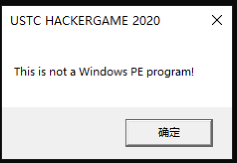
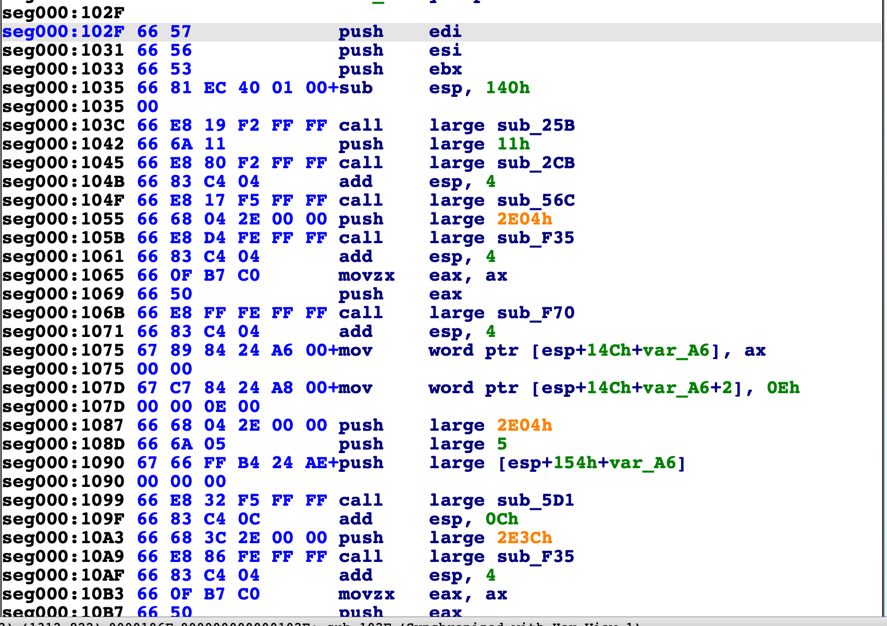
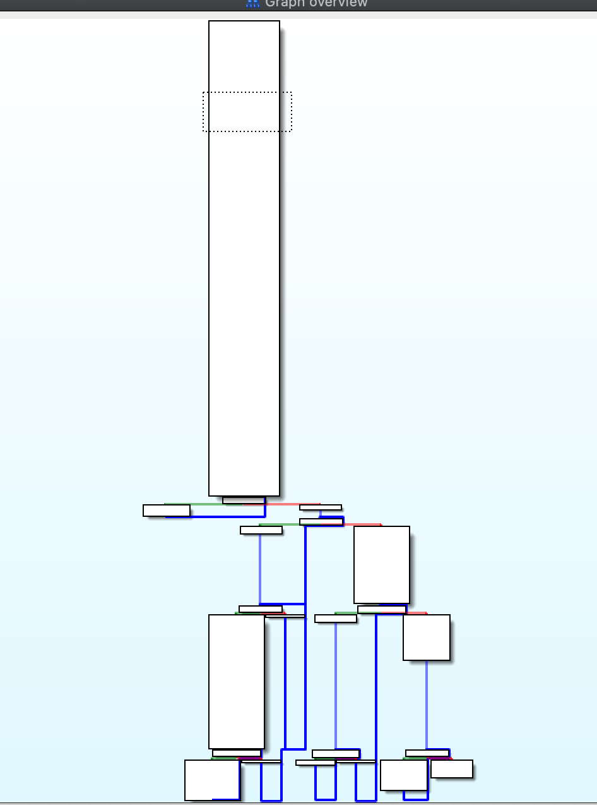

# Flag 计算机

此题目基于 [https://github.com/skeeto/dosdefender-ld31](https://github.com/skeeto/dosdefender-ld31) 修改而成。

```
由于我太菜了，所以引入了一个 BUG 导致题目下线修改后上线。给大家带来了不便，十分抱歉。
```

这道题主要想展现的效果是在 DOS 和 Windows 上都能运行的程序。在 Windows 上运行将弹出一个对话框。

这和我们在 DOS 上运行 Windows PE 程序在 DOS 中输出"This program cannot be run in DOS mode"相照应。如果我们把程序载入 010editor就会发现一些猫腻。

我们会发现原来的 DOS stub 充满了代码。实际上我是先编译了一个 COM 可执行文件，然后手动为 COM 文件加上 DOS 头。所以在此过程中 DOS 中的一些值是手工进行设置的。
然后我将能够运行的 DOS 可执行文件设置为 visual studio 2019 中的 exe 的 DOS stub。最终编译成了你们现在看到的样子。

## 逆向分析

我们将它拖入ida

我们选择让 IDA 分析 MS-DOS executeble。
然后我们观察 start 函数。

我们发现它调用了一个函数，然后执行了 DOS exit 中断，IDA 已经将其标注了出来。

```
这里用了一个 CPU 指令前缀的编译方法，使得我们的 80386 能够在实模式使用 32 位操作数。0x66
：它属于 Prefix group 3，Operand-size override prefix。
```
有了这样一个 opcode 会有怎么样的行为呢？

可以看到 operand size 变为了 32bit。
我们分析 102f 这个函数。

可以看到使用了大量使用这个技巧的痕迹，这就是为什么我们能在实模式使用 32bit 寄存器的原因。

```
asm (".code16gcc\n"
     "call  dosmain\n"
     "mov   $0x4C,%ah\n"
     "int   $0x21\n");
```
最先展开的 include 项目中有我们的 init.h 。
这个文件中的一个伪指令 ".code16cc" 代表着让gcc生成 16bit realmode 模式的汇编指令。所以这是为什么大量指令前都有 0x66 的原因。当我们的操作数是类似于 uint32 声明时，0x66 就会起作用。
逆向的核心过程就是明白程序干了哪些事情，橙色的操作数代表着地址，我们将鼠标悬停在上面，然后右键把它类型转换一下。

IDA 就能识别字符串了。
ps: 作为一个CTF玩家，我最喜欢的事情就是按 F5 ，hackergame 是为了让人能学到东西，而不是千篇一律的难题，不是为了难而难。所以我程序在 realmode 下，IDA 失效了，这样大家都能从 “0” 接触汇编。
显而易见的是，参数是字符串的一般就是我们的类似的 printf 函数。只不过这里是 vga 的输出而已。

我们看整个控制流，发现程序并不复杂，大多数都是控制显示的逻辑。
大家可以对着源代码再看一遍，这个函数就是对应的 main 函数。

下面讲下程序的核心逻辑。