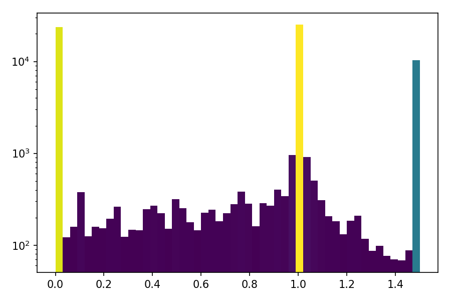
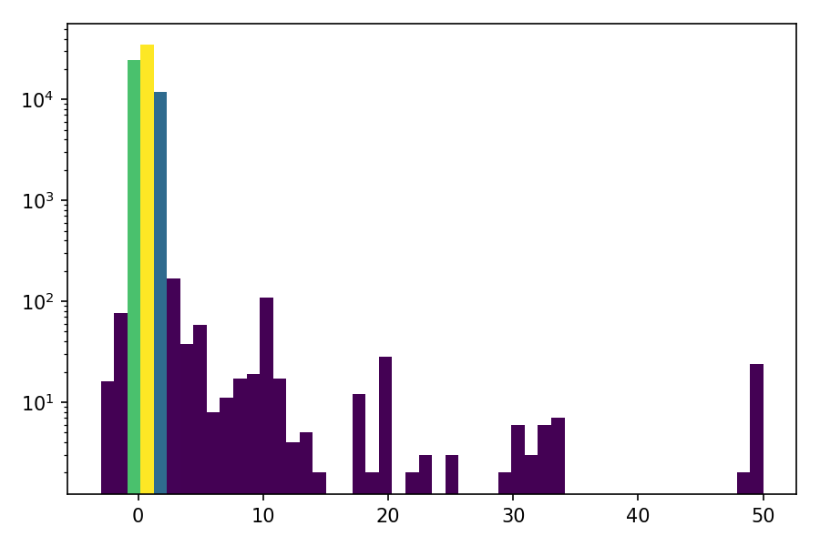

# 签到

这道题继承了 [去年的签到题](https://github.com/ustclug/hackergame2019-writeups/blob/master/official/%E7%AD%BE%E5%88%B0%E9%A2%98/README.md)，同样也需要在浏览器中动点手脚。

## 题目分析

打开签到题页面，拖动滑杆，如果将滑杆滑动到最左边，提交 0，那么我们会得到成功的返回，但是没有 flag，尝试手动提交一些非整数的值，发现得到返回信息：

> 我可以给你 1 个 flag、2 个 flag、3 个 flag…… 但我没法给你 0.16326 个 flag。

返回信息提示我们要提交正整数的值，比如 1，而不是一个小数的值。

## 简单做法

通过分析发现，这个滑杆的数值其实是通过浏览器地址栏中的一个参数来控制的，所以直接修改地址栏中的参数 number 的值为 1 即可，修改后回车即可得到 flag。

## 复杂做法

有的同学一定要把滑杆拖动到 1 才肯罢休，但即使是用键盘方向键操纵，最后数值也不会停留在 1。

分析前端页面，我们可以看到这么一段 JavaScript 代码：

```javascript
var prevVal = 0;
$(document).ready(function() {
        $("#show").text($('#number')[0].value);
        $('#number').on('input', function() {
            if ($('#number')[0].value.toString() === "1") {
                console.log('没想到吧!');
                $('#number')[0].value = 1.00001;
                if (prevVal == 1.00001)  $('#number')[0].value = 0.99999;
                if (prevVal == 0.99999)  $('#number')[0].value = 1.00001;
            }
            $("#show").text($('#number')[0].value.toString());
            prevVal = $('#number')[0].value;
    });
});
```

其中 `console.log('没想到吧!');` 所在的代码块就是判断在滑杆数值变动时是否为 1，如果为 1 就跳过的代码，所以我们无法手动拖动或键盘控制滑杆的值到 1。

但是我们可以直接参考这段代码，直接把滑杆的值设置为 1，具体来说，打开 Chrome 的开发者工具（F12），在 Console 标签下输入以下代码执行，即可将滑杆的值设置为 1，然后点击提交就可以得到 flag：

```javascript
$('#number')[0].value = 1;
```

## 一些统计

下面是比赛期间服务器统计的收到的 number 值的统计：



