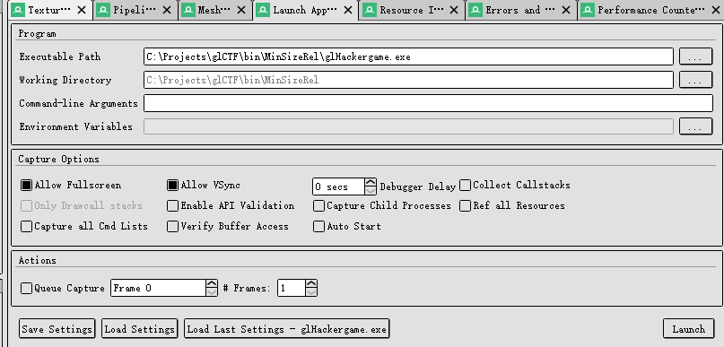
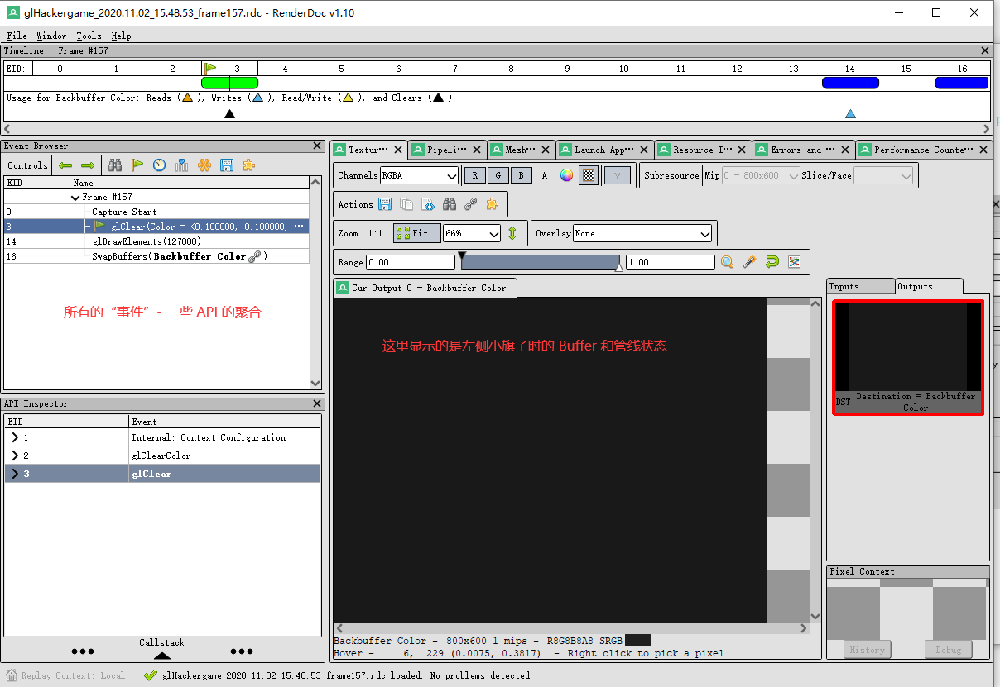
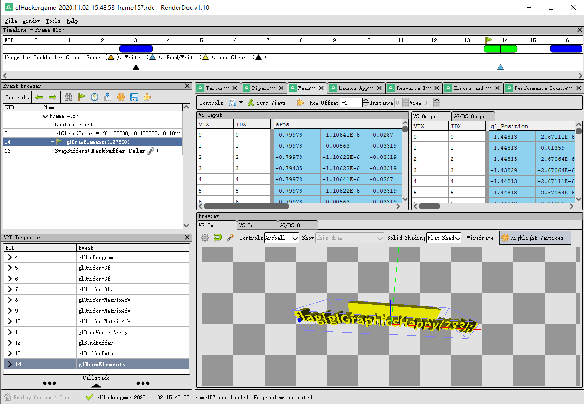

# 超简陋的 OpenGL 小程序

此题目是 LearnOpenGL 教程中『基本光照』一节魔改而成。如果还不清楚基本的渲染管线和 OpenGL 知识的可以参考 LearnOpenGL 教程。

这个题目的出题思路其实就是“你的 flag 被其它的东西挡住了“。之前和 djh 他们讨论这个问题的时候，我提到在游戏开发里面经常会遇到绘制顺序和 Shader 错误导致的 bug，这种时候我们一般都抓帧blabla...

之后，就想出一道简单的图形学题目来让大家玩一玩 OpenGL，了解一些 Realtime Rendering 的基础知识。

data.bin 里面其实就是一些顶点和索引，我把模型用 Blender 做好之后，用 assimp 进行 Triangulation 并且输出到一个自制的 binary 格式。具体可以参考 challenges 仓库里面本题源码的 util 文件夹。

下面给出两种做法：

## RenderDoc 大法

在图形程序 Debug 中，我们经常会使用 RenderDoc 等类似工具截帧。RenderDoc 会截获并显示 OpenGL 调用。

下载 RenderDoc v1.10，如图所示运行程序。



在打开的窗口中按 F12 截帧，得到如下结果。

我们在 Mesh View 选项卡（如果没有，就先点击 Pipeline，再看 VTX 处的 Mesh View）可以直接看到 Mesh。



好，做完了（

## 魔改 Shader

另一个简单的想法是，只要我们在片段着色器（Fragment Shader）中把挡在 flag 前面的片段 discard 掉，我们就可以在屏幕上看到 flag 了。

> 当然，也可以有很多其它的想法，比如
>
> - 在 Vertex Shader 中把模型的 z 方向进行拉伸，使得挡在 flag 前面的”砖头"因为光栅化前的坐标裁剪而被裁剪掉
> - 在 Vertex Shader 中镜像一下顶点的位置，把 flag 挪到前面去
>
> 等等等等...方法其实挺多的

于是修改 Shader 如下：

> （这里我们在 Vertex Shader 中新加入了一个输出 OrigPos）

### 顶点着色器 - basic_lighting.vs

```glsl
#version 330 core
layout (location = 0) in vec3 aPos;
layout (location = 1) in vec3 aNormal;

out vec3 FragPos;
out vec3 Normal;
out vec3 OrigPos;

uniform mat4 model;
uniform mat4 view;
uniform mat4 projection;

void main()
{
    FragPos = vec3(model * vec4(aPos, 1.0));
    Normal = aNormal;
    OrigPos = aPos;

    gl_Position = projection * view * vec4(FragPos, 1.0);
}
```

### 片段着色器 - basic_lighting.fs

```glsl
#version 330 core
out vec4 FragColor;

in vec3 Normal;  
in vec3 FragPos;
in vec3 OrigPos;
  
uniform vec3 lightPos; 
uniform vec3 lightColor;
uniform vec3 objectColor;

void main()
{
    // ambient
    float ambientStrength = 0.1;
    vec3 ambient = ambientStrength * lightColor;
  	
    // diffuse 
    vec3 norm = normalize(Normal);
    vec3 lightDir = normalize(lightPos - FragPos);
    float diff = max(dot(norm, lightDir), 0.0);
    vec3 diffuse = diff * lightColor;
            
    vec3 result = (ambient + diffuse) * objectColor;

    if (OrigPos.z > -0.0)
        discard;

    FragColor = vec4(result, 1.0);
} 
```


## 总结

~~有手就行~~（雾

其实我对自己的这个题目还是不太满意的，毕竟场景实在是太简单了，也没什么美感可言。

不过，又做不出一个太好的藏 Flag 的场景，所以最后就这样不尴不尬的放了上来...